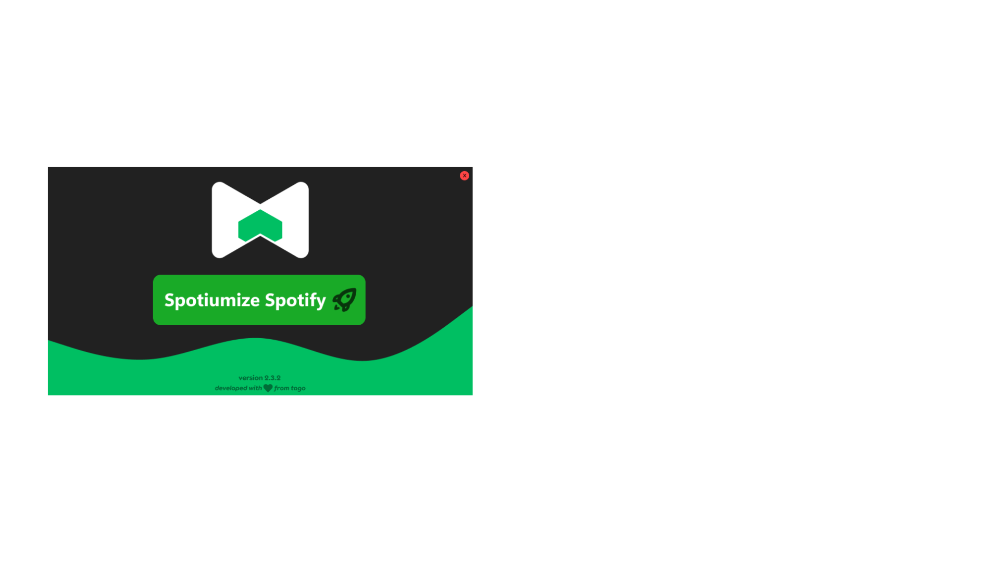

    </a>
     

   
   
   

   *there is definitely an easier way to make a tkinter menu but idc*

Spotium does not include any viruses, backdoors, trojans, or any other type of malicious software or code. Additionally, Spotium rarely updates but when it does it is important, Spotium checks for updates automatically. You can view the latest Spotium files VirusTotal result for windows and for macOS. On March 20, 2024 Spotium has gone open source to further prove this, and allow the community to contribute.
